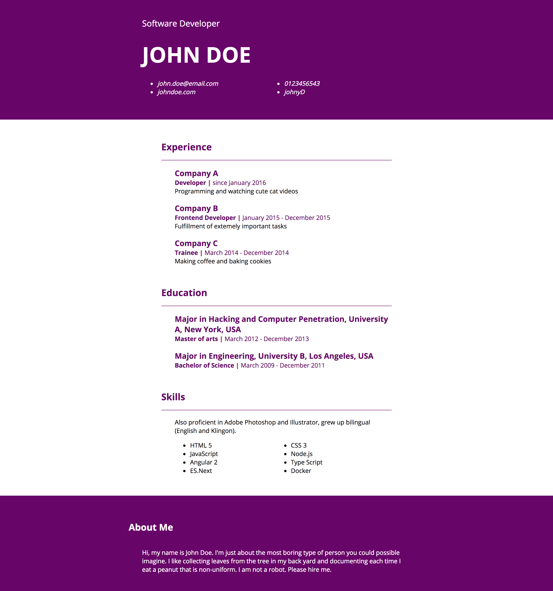

# session-4
Styles et mise en forme

## Étapes

- [ ] Forker ce projet dans votre espace personnel sur Github
- [ ] Cloner le fork dans Github Desktop

Vous allez travailler sur le fichier styles.css, qui contiendra tous les styles du CV composé de index.html. Le fichier styles.css contient déjà la structure des sélecteurs CSS dont vous aurez besoin. Vous pouvez cependant la modifier.

- [ ] En utilisant au maximum la liste de propriétés CSS ci-dessous, et en utilisant les couleurs et les polices de votre choix, modifiez la feuille de styles générale du CV.

Celui-ci doit s'approcher au maximum du rendu suivant : 



> Pensez à "aérer" votre code en sautant des lignes et en créant des indentations. Cela ne modifie pas le rendu et permet une meilleure lisibilité.

## Get started with CSS

Le CSS fait référence au HTML. Il désigne le contenu du site par le nom des balises HTML qui le structure.

Il peut s'écrire à plusieurs endroits : 

- Directement dans une balise HTML. Il est alors dit **Inline**. 
```html
  <p style="font-size: 24px;">Ce paragraphe a une taille de caractères de 24 pixels</p>
```
- Dans une page HTML, comme dans l'exemple ci-dessous. Il est alors dit **Interne**. 
```html
<html>
  <head>
    <style>
      p {
        font-size: 24px;
      }
    </style>
  </head>
  <body>
    <p>Tous les paragraphes ont une taille de caractères de 24 pixels</p>
  </body>
</html>
```
- Dans une feuille séparée (un fichier avec l'extension .css), "appelée" de la manière suivante. Il est alors dit **Externe**.
```html
<html>
  <head>
    <link rel="stylesheet" type="text/css" href="styles.css">
  </head>
  <body>
    <p>Tous les paragraphes ont une taille de caractères de 24 pixels</p>
  </body>
</html>
```
```css
p {
  font-size: 24px;
}
```

Le CSS (Cascading Style Sheets) est un **langage hiérarchique**. La mise en forme dépend de règles définies à plusieurs endroits, et qui interragissent ensemble selon un ordre de priorité.
- Les styles définis en derniers sont prioritaires sur ceux définis en amont.
- Les styles définis de la manière la plus précise sont prioritaires sur ceux définis de manière générale.
   
Exemple : 

```css
p {
  color: red; /* Les paragraphes sont écrits en rouge */
}
article p {
  color: black; /* Les paragraphes dans les balises articles sont écrits en noir */
}
p {
  color: blue; /* Les autres paragraphes sont écrits en bleu */
}
```

D'une manière générale, on écrira les styles sur des feuilles **externes** et on s'arrangera pour écrire le moins de code possible. Les styles généraux de façon générale, et les choses les plus précises de manière précise.

On désigne une balise par son nom, une classe en la précédant d'un point, un identifiant en le précédant d'un dièze.

## Les propriétés CSS

### Les polices

Pour importer des polices particulières, suivre les instructions sur le site [Google Fonts](https://fonts.google.com/).

- Police de caractères : `font-family: "Source Sans Pro", sans-serif;`
- Taille de la police : `font-size: 14px, 2em;`
- Gras : `font-weight: 400, 600;`
- Italique : `font-style: italic, oblique, normal;`
- Soulignement : `font-decoration: underline, overline, line-through;`
- Petites capitales : `font-variant: small-caps;`
- Capitales : `text-transform: uppercase, lowercase, capitalize;`
- Alignement: `text-align: left, right, center;`
- Hauteur de ligne: `line-height: 24px;`
- Indentation: `text-indent: 54px;`
- Césures : `white-space` et `word-wrap`
- Ombre portée : `text-shadow: 5px 5px 2px blue;`

### Les couleurs et le fond

- Couleur du texte: `color: red, #ff4543, rgb(24,43,56);`
- Couleur de fond du bloc : `background-color: red, #fd5432;`
- Image de fond : `background-image: url('monimage.jpg');`
- Répétition de l'image de fond: `background-repeat: repeat, no-repeat;`
- Position de l'image de fond : `background-position: left top, center center;`
- Opacité du bloc: `opacity: 0.4;`

### Propriétés des blocs

- Largeur: `width: 234px, 23%;`
- Largeur minimale: `min-width: 34px;`
- Largeur maximale: `max-width: 456px;`
- Hauteur: `height: 34px;`
- Hauteur minimale: `min-height: 45px;`
- Hauteur maximale: `max-height: 543px;`
- Marge extérieure du haut: `margin-top: 34px;` et ainsi de suite pour les autres marges extérieures
- Marge intérieure du haut: `padding-top: 54px;` et ainsi de suite pour les autres marges intérieures
- Pour centrer horizontalement un bloc, on utilisera `margin: auto;`
- Épaisseur de la bordure: `border-width: 4px;`
- Couleur de la bordure: `border-color: red;`
- Type de bordure: `border-style: dashed, solid, dotted, double`
- Arrondi de la bordure: `border-radius: 12px, 50%`
- Ombrage du bloc : `box-shadow: 6px 6px 0px black;`

### Propriétés des listes

- Type de liste: `list-style-type: disc, circle, square, decimal, lower-roman, upper-roman, lower-alpha, upper-alpha, none;`
- Retrait de l'indicateur de liste: `list-style-position: inside, outside;`
- Liste personnalisée : `list-style-image: url('monimage.jpg');`

- Curseur de la souris : `cursor: crosshair, default, help, move, pointer, progress, text, wait, e-resize, ne-resize, auto;`
